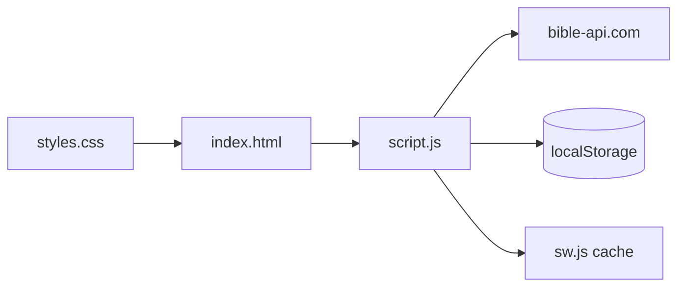

# Agent Guide & Change Tracker — Bíblia RSVP

**Purpose:** This file is the working guide for AI agents (and humans) on the `bible-rsvp` project. It summarizes architecture, conventions, and sensitive areas. The **Change Log** at the bottom records every modification with date and time (UTC).

**Companion docs:**
- `instruction.md` — detailed feature spec and AI workflow (user-provided, not always in git)
- `README.md` — deployment and API scalability notes

**Repository:** https://github.com/HerreraCarlos81/bible-rsvp  
**Maintainer:** Carlos Herrera (@CodedNeurons)

---

## Quick Start for Agents

1. Read this file and the **Change Log** (latest entries first).
2. For feature context, also read `instruction.md` if present.
3. **95% of logic** lives in `js/script.js` — read surrounding code before editing.
4. **No frameworks** — vanilla HTML/CSS/JS only. Do not add npm, React, Tailwind, etc., unless explicitly requested.
5. After any code change, append a new row to the **Change Log** with UTC timestamp, files touched, and a short description.
6. Prefer minimal, focused diffs; match existing naming and Portuguese UI strings.

---

## Project Snapshot

| Item | Value |
|------|--------|
| **Last audited** | 2026-06-07 (full Route53 + ACM + CloudFront for bible-focus.site complete) |
| **Stack** | HTML5, CSS3, vanilla JavaScript |
| **Bible API** | `https://bible-api.com/` (rate-limited; see constraints) |
| **Versions** | KJV (English), Almeida (Portuguese) |
| **Hosting target** | AWS S3 (secured) + CloudFront (E1ZVWCS6KPUBYE, dilbg8i3y2jdz.cloudfront.net, ACM pending for custom) |
| **PWA** | `manifest.json` + `sw.js` (cache v1) |

### Line counts (as of last audit)

| File | Lines |
|------|------:|
| `js/script.js` | 813 |
| `css/styles.css` | 383 |
| `index.html` | 215 |
| `sw.js` | ~46 |
| `manifest.json` | 22 |

---

## What This App Does

**Bíblia RSVP** is a Bible speed-reading web app using **Rapid Serial Visual Presentation (RSVP)** — words or small chunks flash in the center at a configurable WPM rate. Users select book/chapter, preview text, then enter fullscreen RSVP mode with verse and chapter navigation, history, and streak tracking.

---

## File Map

```
bible-rsvp/
├── index.html          # UI: selectors, preview, settings, RSVP modal, ad placeholder
├── css/styles.css      # Dark theme, gold accents, responsive layout
├── js/script.js        # All application logic (primary edit target)
├── manifest.json       # PWA metadata (standalone, theme #0f172a)
├── sw.js               # Service worker — caches shell assets (not API responses)
├── instruction.md      # Extended project instruction (may be untracked)
├── README.md           # Deploy + API migration notes
├── LICENSE
└── agent.md            # This file
```

---

## Architecture



### Data flow (chapter load)

1. User selects version, book, chapter → `loadChapter()` → `loadChapterData(slug, num)`
2. `fetch` to `BIBLE_API` + book path + chapter
3. `parseVerses(rawText)` builds `verses[]` with word indices
4. `currentWords[]` flattened for RSVP loop
5. UI preview update (history is now saved only on RSVP completion in `finishReading()`, not on load)

### RSVP loop

`startRSVP()` → `showNextWord()` (recursive `setTimeout`) → `updateRSVPUI()` → on end `finishReading()`

---

## `js/script.js` — Section Guide

| Lines (approx) | Topic |
|----------------|--------|
| 1–72 | `BIBLE_API`, `books[]` (66 books, slug/name/ptName/chapters) |
| 74–83 | State: `currentWords`, `currentIndex`, `wpm`, `chunkSize`, `verses`, etc. |
| 85–108 | DOM element references |
| 110–141 | PWA: `initPWA()`, install prompt |
| 143–220 | History & streak: `getHistory`, `saveHistory`, `updateStreak`, `renderHistory`, `clearHistory` |
| 222–300 | Verse parsing & RSVP UI: `parseVerses`, `getCurrentVerse`, `jumpToVerse`, `updateRSVPUI` |
| 302–394 | `init()`, book/chapter dropdowns |
| 395–570 | Loading: `loadChapterData`, `loadChapter`, `scrollToPreview` |
| 489–584 | RSVP engine: `startRSVP`, `showNextWord`, `togglePause`, `finishReading`, `closeRSVP` |
| 585–662 | Chapter nav: `goToNextChapter`, `goToPreviousChapter` |
| 663–772 | Controls & keyboard: `setupVerseNavigation`, `setupRSVPControls`, `handleKeyboard` |
| 774–813 | Settings persistence, init calls, `window.BibliaRSVP` debug export |

### Function index (verified line numbers)

| Function | Line | Role |
|----------|-----:|------|
| `initPWA` | 113 | Register SW, install button |
| `getHistory` / `saveHistory` | ~212 / ~216 | Reading history (max 20); now only on chapter *completion* via RSVP |
| `updateStreak` | ~230 | Consecutive-day streak (calendar-day based) |
| `parseVerses` | 222 | API text → `verses[]` — **sensitive** |
| `jumpToVerse` | 274 | Seek to verse start index |
| `loadChapterData` | ~494 | Main API fetch + state prep (no longer calls saveHistory) |
| `startRSVP` / `showNextWord` | ~572 / ~597 | RSVP engine |
| `finishReading` | ~634 | Now records to history + streak on successful completion |
| `goToNextChapter` / `goToPreviousChapter` | ~667 / ~706 | Cross-chapter (incl. book boundaries) |
| `handleKeyboard` | ~815? | All RSVP shortcuts |
| `saveSettings` / `loadSavedSettings` | ~854 / ~867 | User prefs (last selection) |

---

## Defaults & Configuration

```js
// js/script.js state (lines 79-81)
wpm = 300 (`DEFAULT_WPM` constant);
chunkSize = 1;
punctuationPause = true;
```

| Setting | UI / range |
|---------|------------|
| WPM slider | 100–1200, step 10 (`#wpm-slider`) |
| Chunk buttons | 1, 2, 3 words |
| Font slider | 2–6 rem, step 0.2 |
| History cap | 20 entries |
| History display | Last 5 in UI |

---

## localStorage Keys

| Key | Contents |
|-----|----------|
| `biblia-rsvp-history` | Array of reading entries |
| `biblia-rsvp-settings` | `{ version, book, chapter, wpm, chunkSize }` |

---

## Keyboard Shortcuts (RSVP modal only)

| Key | Action |
|-----|--------|
| Space | Pause / resume |
| ← / → | Previous / next verse |
| Page Up / Page Down | Previous / next chapter |
| R | Restart chapter |
| Esc | Exit RSVP (shows ads again) |

**In-modal only (not keyboard):** WPM ±50 via `#speed-up` / `#speed-down`; chunk 1–5 via `#chunk-up` / `#chunk-down` (`setupRSVPControls`, lines 691–713). Note: `instruction.md` mentions Arrow Up/Down for WPM, but `handleKeyboard` does not implement them yet.

---

## Important DOM IDs

**Main:** `#version`, `#book`, `#chapter`, `#load-btn`, `#preview-card` (contains `#start-btn`), `#settings-card`, `#history-card`, `#ad-container`

**RSVP modal:** `#rsvp-modal`, `#rsvp-word`, `#pause-btn`, `#close-rsvp`, `#prev-verse-btn`, `#next-verse-btn`, `#prev-chapter-btn`, `#next-chapter-btn`

---

## External API Constraints

- **Limit:** ~15 requests per 30 seconds per IP (per README / bible-api.com)
- **Not for bulk download** — production should migrate to static JSON on S3/CloudFront
- **URL pattern:** `buildChapterApiUrl()` — use `ptName` for Portuguese Bibles (Almeida); encode URI
- **Verses:** Prefer `data.verses[]` from API (`buildVersesFromStructured`); plain `text` has no verse numbers

---

## Agent Editing Rules

| Task | Where to edit |
|------|----------------|
| Colors, layout, new UI | `index.html`, `css/styles.css` |
| WPM defaults, chunk logic, RSVP timing | `js/script.js` — state + `showNextWord` |
| Verse boundaries | `parseVerses`, `jumpToVerse` — test edge cases |
| Chapter boundaries | `goToNextChapter`, `goToPreviousChapter` |
| New shortcuts | `handleKeyboard` |
| AdSense | `index.html` → `#ad-container` placeholder |
| Offline / cache bump | `sw.js` — increment `CACHE_NAME` when shell assets change |
| PWA metadata | `manifest.json` |

**Do not:**
- Break pure-vanilla constraint without approval
- Cache-bust SW without updating `CACHE_NAME`
- Remove `window.BibliaRSVP` debug export without reason
- Forget to hide `#ad-container` when RSVP opens (`closeRSVP` / `startRSVP` pattern)

---

## Deployment (S3 + CloudFront)

**Bucket:** `bible-reading.online` (account `668461484419`, `us-east-1`)  
**Live layout:** root-level static site — `index.html`, `manifest.json`, `sw.js`, `css/styles.css`, `js/script.js`, `js/i18n.js`

**CloudFront Distribution (HTTPS):**  
- ID: `E1ZVWCS6KPUBYE`  
- CloudFront domain (immediate HTTPS): `https://dilbg8i3y2jdz.cloudfront.net/`  
- Origin: S3 REST via OAI (secured).  
- Viewer: redirect HTTP→HTTPS, default root `index.html`.

**Primary Custom Domain:** `bible-focus.site` (bought June 2026)
- Managed entirely in **AWS Route53** (new hosted zone).
- Hosted Zone ID: `Z00132622YSKW24SS3C4L`
- **Route53 Nameservers** (set these at your registrar to delegate the domain):
  - ns-1237.awsdns-26.org
  - ns-1989.awsdns-56.co.uk
  - ns-129.awsdns-16.com
  - ns-668.awsdns-19.net
- Alias A + AAAA records created in Route53 pointing directly to the CloudFront distribution (recommended for apex domains).

**ACM Certificate (for bible-focus.site HTTPS):**
- ARN: `arn:aws:acm:us-east-1:668461484419:certificate/2da26a23-8789-4f93-9360-aa70a207b74c`
- Status: **ISSUED** (validated after NS delegation)
- InUseBy: CloudFront dist E1ZVWCS6KPUBYE

**CloudFront Distribution (E1ZVWCS6KPUBYE):**
- Aliases: `bible-focus.site`, `www.bible-focus.site` (active)
- ViewerCertificate: ACM cert (sni-only + TLSv1.2_2021)
- Status after update: InProgress (domains already serving successfully)

**Live URLs:**
- https://bible-focus.site
- https://www.bible-focus.site
- Fallback / direct: https://dilbg8i3y2jdz.cloudfront.net

**Automation:** A monitor script was used to watch NS propagation + ACM issuance and auto-apply the CloudFront update + invalidation. Full script available at `/tmp/monitor-domain.sh` for review.

**Legacy:** The previous `bible-reading.online` setup remains but `bible-focus.site` is now the primary target.

```bash
./deploy.sh --dry-run   # preview
./deploy.sh -y          # upload
```

**Invalidate after deploy:** `export BIBLE_RSVP_CLOUDFRONT_ID=E1ZVWCS6KPUBYE` (or set in env); `deploy.sh` will call `create-invalidation` for `/*`.

Direct S3 website endpoint (`http://bible-reading.online.s3-website-us-east-1.amazonaws.com/`) now returns 403 (bucket locked to OAI only — access only via CloudFront).

## Deployment Checklist

1. Run `deploy.sh` (or manual upload) to S3 — set `BIBLE_RSVP_CLOUDFRONT_ID=E1ZVWCS6KPUBYE` for auto-invalidation
2. Primary access: `https://bible-focus.site` (and `https://www.bible-focus.site`)
3. Fallback / direct CF: `https://dilbg8i3y2jdz.cloudfront.net/`
4. Replace AdSense placeholder in `index.html`
5. Plan migration from `bible-api.com` to static JSON on same origin
6. Hard-refresh / SW cache bump after deploy (`sw.js` `CACHE_NAME`)

---

## Backlog (from instruction.md / README)

1. Migrate Bible text to S3 static JSON
2. Auto-advance to next chapter on finish (optional setting)
3. Verse highlighting in preview
4. Chunk size up to 5 words
5. Reading statistics (total chapters, avg WPM)
6. Python script to generate/upload JSON Bible files
7. Optional AWS Lambda + DynamoDB for accounts (future)

---

## Change Log

All times are **UTC**. Newest entries first. Every agent session that changes code **must** add an entry.

| Date | Time (UTC) | Author | Files | Summary |
|------|------------|--------|-------|---------|
| 2026-06-07 | 14:30:00 | Agent (Grok) | `agent.md`, `deploy.sh`, `instruction.md`, `README.md` | Completed production hosting setup for primary domain `bible-focus.site`. Route53 hosted zone + 4 NS delegation at registrar, ACM cert issued and validated, CloudFront distribution updated with aliases + custom ACM cert (E1ZVWCS6KPUBYE). Invalidation created. Custom domains live and serving correctly. Updated all control docs and change log. Background monitor script automated the final CF update step. | 
| 2026-06-07 | 14:20:00 | Agent (Grok) | `deploy.sh`, `agent.md`, `instruction.md`, `README.md` | New primary domain `bible-focus.site` purchased. Created Route53 hosted zone (Z00132622YSKW24SS3C4L), ACM cert (2da26a23...), DNS validation records, and A/AAAA Alias records pointing to CloudFront. Prepared CF distribution update (aliases + custom cert). Provided full registrar nameserver delegation instructions. Old bible-reading.online kept as legacy. Updated all docs. | 
| 2026-06-06 | 15:05:00 | Agent (Grok) | `deploy.sh`, `agent.md`, `instruction.md`, `README.md` | Created CloudFront distribution (E1ZVWCS6KPUBYE / dilbg8i3y2jdz.cloudfront.net) with OAI-secured S3 origin for HTTPS access (solves device/http issues with direct S3 website). Requested ACM cert (pending DNS validation) for custom domains. Updated S3 bucket policy + public blocks to lock to OAI only. Updated deploy.sh + all docs with IDs, URLs, validation records, DNS steps, and usage. Permission checks confirmed full admin access (no extra perms needed). |
| 2026-06-05 | 17:29:34 | Agent (Grok) | `js/script.js`, `agent.md` | Persist last bible version, book and chapter (via `biblia-rsvp-settings` localStorage) so dropdowns restore on return visit for continuous reading. Fixed init() default override of `loadSavedSettings()`; improved restore logic (sync, safe guards, no setTimeout); added chunkSize UI restore. |
| 2026-06-05 | 17:36:50 | Agent (Grok) | `js/script.js`, `instruction.md`, `agent.md` | Reading history + streak now only recorded on actual completion (finishReading() when RSVP reaches end of chapter), not on Load Chapter. Fixed streak calculation to use calendar-day keys (YYYY-MM-DD) so consecutive days are detected reliably (previous time-of-day diffs often failed to increment). Updated docs. |
| 2026-06-05 | 01:51:17 | Agent (Grok) | `index.html`, `js/script.js`, `js/i18n.js`, `README.md`, `instruction.md`, `agent.md`, `.gitignore`, `deploy.sh` | Removed sample button; WPM 300; scroll-to-preview; light theme + Almeida fix; `deploy.sh` replaces `deploy.py`; docs updated. |
| 2026-06-04 | 21:19:08 | Agent (Grok) | `deploy.sh`, `agent.md` | S3 deploy shell script for `bible-reading.online` (replaces deploy.py). |
| 2026-06-04 | 20:48:58 | Agent (Grok) | `js/i18n.js`, `js/script.js`, `index.html`, `css/styles.css`, `sw.js` | UI language switch (EN/PT flags, system locale detect, default EN). Book names match Bible language only. Added PD translations: WEB, ASV, BBE, Darby (+ KJV, Almeida). |
| 2026-06-04 | 19:55:07 | Agent (Grok) | `js/script.js`, `index.html` | Default WPM 250 (`DEFAULT_WPM`). Fixed verse/word stats: use API `data.verses` via `buildVersesFromStructured()` (API `text` has no verse numbers; regex fallback was counting 1 verse). |
| 2026-06-04 | 19:42:09 | Agent (Grok) | `README.md` | Rewrote for repo visitors and supporters: what the app is, features, how to try, support section; moved dev/deploy/API details to brief pointer to `agent.md`. |
| 2026-06-04 | 19:35:00 | Agent (Grok) | `agent.md` | Clarified WPM/chunk controls: in-modal buttons only; noted `instruction.md` vs `handleKeyboard` mismatch on Arrow Up/Down. |
| 2026-06-04 | 19:32:57 | Agent (Grok) | `agent.md` | **Created** this guide after full project study: architecture map, verified `script.js` line index, localStorage keys, agent rules, and initial change log. No application code modified. |

---

### Change Log Entry Template

Copy and prepend a new row for each change:

```markdown
| YYYY-MM-DD | HH:MM:SS | Agent (name) | `file1`, `file2` | Short description of what changed and why |
```

**Example:**

```markdown
| 2026-06-05 | 14:00:00 | Agent (Grok) | `js/script.js` | Added auto-advance to next chapter in `finishReading()` behind a settings flag |
```

---

*Last updated: 2026-06-07 14:25:00 UTC (bible-focus.site + Route53 full setup)*